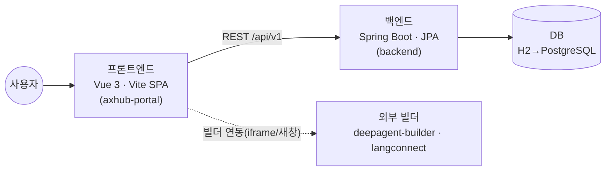
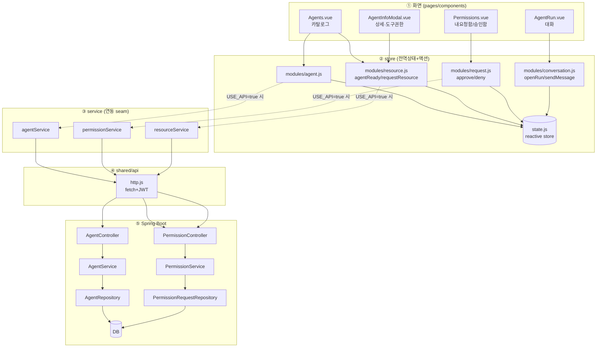
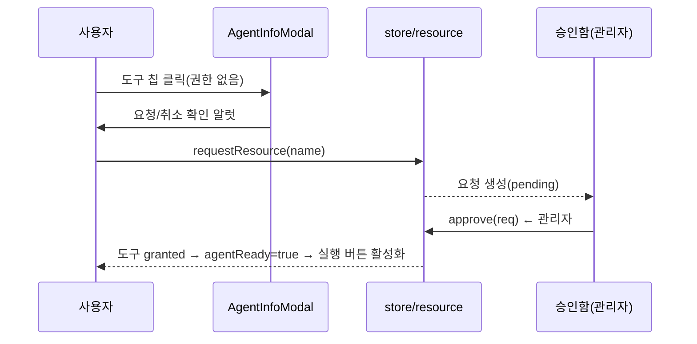

# AX-HUB 아키텍처 & 개발 가이드

> 대상: 이 프로젝트를 이어받아 개발할 **초·중급 개발자**
> 목적: 전체 구조·호출 흐름·담당 분할·코딩 규약을 한 문서로 파악한다.

---

## 1. 시스템 개요



- **프론트**: 화면·상태관리. 현재는 목(mock) 데이터로 단독 동작하며, `VITE_USE_API=true` 로 실제 백엔드에 연결.
- **백엔드**: REST API. 도메인별 레이어드 구조(Controller→Service→Repository→Entity).
- **연동 스위치**: `src/shared/api/config.js` 의 `USE_API` 하나로 mock ↔ 실서버 전환.

---

## 2. 프론트엔드 폴더 구조 (표준)

```
src/
├─ app 진입          main.js · App.vue · styles.css
├─ shared/           ★ 공통 개발자 담당 (모든 화면이 공유)
│  ├─ api/
│  │  ├─ config.js   USE_API 토글, API_BASE, TOKEN_KEY
│  │  └─ http.js     fetch 래퍼(JWT 헤더·에러 정규화·응답 언랩)
│  ├─ constants/enums.js   권한/상태/스코프/역할 상수
│  ├─ utils/format.js      날짜·숫자·문자 포맷
│  └─ models/types.js      JSDoc 타입 정의(백엔드 DTO 와 일치)
├─ store/            ★ 공통 개발자 담당 (전역 상태 + 도메인 액션)
│  ├─ state.js       전역 reactive 상태 (Single Source of Truth)
│  ├─ index.js       배럴(모든 액션 재노출)
│  └─ modules/       도메인별 액션
│     ├─ ui.js  session.js  meta.js       (공통)
│     ├─ agent.js  conversation.js         (개발자 A)
│     ├─ request.js  resource.js           (개발자 C)
│     └─ (knowledge/community 는 화면 computed 로 처리)
├─ store.js          (하위호환 shim → store/index.js 재노출)
├─ features/         ★ 화면 담당자별 기능 모듈
│  ├─ agent/services/agentService.js         (개발자 A)
│  ├─ knowledge/services/knowledgeService.js (개발자 B)
│  ├─ community/services/communityService.js (개발자 B)
│  ├─ permission/services/{permission,resource}Service.js (개발자 C)
│  └─ auth/services/authService.js           (공통)
├─ pages/            화면(라우팅 단위)
│  ├─ Home.vue(대시보드)  Agents.vue  AgentRun.vue   (A)
│  ├─ Knowledge.vue  Community.vue                    (B)
│  └─ Permissions.vue                                 (C)
└─ components/       재사용 컴포넌트
   ├─ Icon.vue  StatusPill.vue  Steps.vue             (공통)
   ├─ AgentInfoModal.vue  AgentFab.vue  BuilderModal.vue (A/공통)
   ├─ KnowledgeTreeNode.vue                           (B)
   └─ RequestModal.vue  DenyModal.vue                 (C)
```

### 레이어링 규칙 (반드시 지킬 것)
```
화면(pages/components)  →  store(액션)/service  →  shared/api(http)  →  백엔드
```
- 화면은 **store 상태를 읽고, 액션/service 를 호출**만 한다. (화면에서 fetch 직접 호출 금지)
- 백엔드 연동은 **service 파일 안에서만** 한다. (`USE_API` 분기 지점)
- 공통(shared·store·공통 컴포넌트)은 **공통 개발자만** 수정한다.

---

## 3. 백엔드 폴더 구조 (표준)

```
backend/src/main/java/com/axhub/
├─ common/          ★ 공통 개발자
│  ├─ response/ApiResponse           {success,data,message} 표준 응답
│  ├─ exception/BusinessException, GlobalExceptionHandler
│  ├─ config/SecurityConfig          보안(JWT·CORS)
│  └─ entity/BaseTimeEntity          생성/수정 시각 자동
├─ agent/           개발자 A  ✅ 레퍼런스(Controller/Service/Repository/Entity/DTO)
├─ permission/      개발자 C  ✅ 레퍼런스(요청·승인 흐름)
├─ knowledge/       개발자 B  🔧 스캐폴드
├─ resource/        개발자 C  🔧 스캐폴드
├─ community/       개발자 B  🔧 스캐폴드
└─ auth/            공통     🔧 스캐폴드
```
> `agent` · `permission` 을 "정답지"로 보고 나머지 도메인을 동일 패턴으로 구현한다.

---

## 4. 전체 서비스 호출 관계도 (풀스택)

가장 완성도 높은 두 흐름(Agent 실행, 도구 권한 요청→승인)을 예로 든다.



### 핵심 업무 규칙 (도메인 로직)
> **Agent 는 누구나 생성/사용할 수 있으나, Agent 가 쓰는 도구(리소스)를 하나라도 보유하지 않으면 실행할 수 없다.**
> - 실행 가능 여부 = `agentReady(agent)` = 모든 `agent.tools` 가 `granted`
> - 미보유 도구 클릭 → 권한 요청 → 운영 관리자 승인 → 도구 `granted` → Agent 실행 가능



---

## 5. 담당자 배분 (개발자 3 + 공통 1)

| 담당 | 프론트 화면/모듈 | 백엔드 도메인 | 주요 파일 |
|------|------------------|---------------|-----------|
| **개발자 A** | 대시보드, Agent 카탈로그·상세·실행(대화) | `agent` | Home/Agents/AgentRun.vue, store/modules/agent·conversation.js, agentService |
| **개발자 B** | 지식(RAG) 카탈로그, 커뮤니티 | `knowledge`, `community` | Knowledge/Community.vue, KnowledgeTreeNode.vue, knowledge/communityService |
| **개발자 C** | 요청함/승인함, 도구 권한 흐름 | `permission`, `resource` | Permissions.vue, RequestModal/DenyModal, store/modules/request·resource.js |
| **공통 개발자** | shared/*, store/state·index·ui·session·meta, 공통 컴포넌트, 인증, 스타일 | `common`, `auth` | shared/api·constants·utils, Icon/StatusPill/Steps.vue, SecurityConfig, styles.css |

**협업 규칙**
1. 공통 영역(shared·store 코어·공통 컴포넌트·styles.css) 변경은 **공통 개발자 리뷰 필수**.
2. 각 담당은 자기 `features/<도메인>`·`pages`·백엔드 `<도메인>` 패키지 안에서 작업.
3. 새 API 는 프론트 service ↔ 백엔드 controller **양쪽을 같은 PR** 로 반영.

---

## 6. 코딩 컨벤션

**공통**
- 파일 상단 주석에 역할 + `[담당: 개발자 X]` 명시.
- 매직 문자열 금지 → `shared/constants/enums.js` 사용.
- 날짜/숫자 표시 → `shared/utils/format.js` 사용.

**프론트(Vue3)**
- `<script setup>` + Composition API 표준.
- 화면은 store 상태를 읽고 액션 호출만. 비동기 통신은 service 로.
- 컴포넌트/파일: PascalCase(`AgentInfoModal.vue`), 변수/함수: camelCase.

**백엔드(Spring)**
- 컨트롤러는 얇게, 로직은 서비스, DB 접근은 리포지토리.
- 엔티티 직접 노출 금지 → DTO(record) 변환.
- 응답은 `ApiResponse.ok(...)`, 예외는 `BusinessException`.

---

## 7. 실행 방법
```bash
# 프론트
npm install && npm run dev        # http://localhost:5173

# 백엔드
cd backend && ./gradlew bootRun   # http://localhost:8080

# 실연동: axhub-portal/.env
#   VITE_USE_API=true
#   VITE_API_BASE=http://localhost:8080/api/v1
```

---

## 8. API 목록 (프론트 service ↔ 백엔드 controller)
| 기능 | 메서드 · 경로 | 프론트 | 백엔드 |
|------|---------------|--------|--------|
| Agent 목록/상세 | GET `/agents`, `/agents/{id}` | agentService | AgentController ✅ |
| Agent 활성/즐겨찾기 | PATCH `/agents/{id}/active`·`/favorite` | agentService | AgentController ✅ |
| 요청 목록 | GET `/requests?scope=mine\|approve` | permissionService | PermissionController ✅ |
| 요청 생성 | POST `/requests` | permissionService | PermissionController ✅ |
| 승인/반려/취소 | POST `/requests/{id}/approve`·`/deny`, DELETE `/requests/{id}` | permissionService | PermissionController ✅ |
| 내 도구 권한 | GET `/resources/me` | resourceService | ResourceController 🔧 |
| 도구 권한 요청 | POST `/resources/{name}/request` | resourceService | ResourceController 🔧 |
| 지식 목록/카테고리/상세 | GET `/knowledge`·`/knowledge/categories`·`/knowledge/{id}` | knowledgeService | KnowledgeController 🔧 |
| 커뮤니티 | GET `/community/boards`·`/boards/{id}/posts` | communityService | CommunityController 🔧 |
| 인증 | POST `/auth/login`, GET `/auth/me` | authService | AuthController 🔧 |

✅ 레퍼런스 구현 · 🔧 스캐폴드(동일 패턴으로 채우기)
