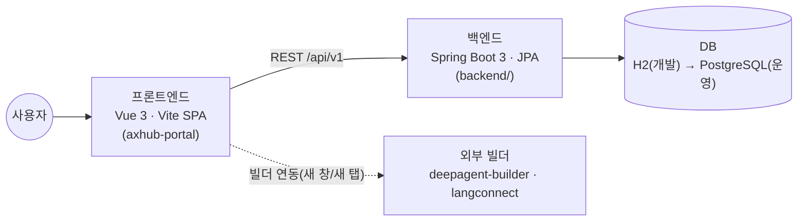
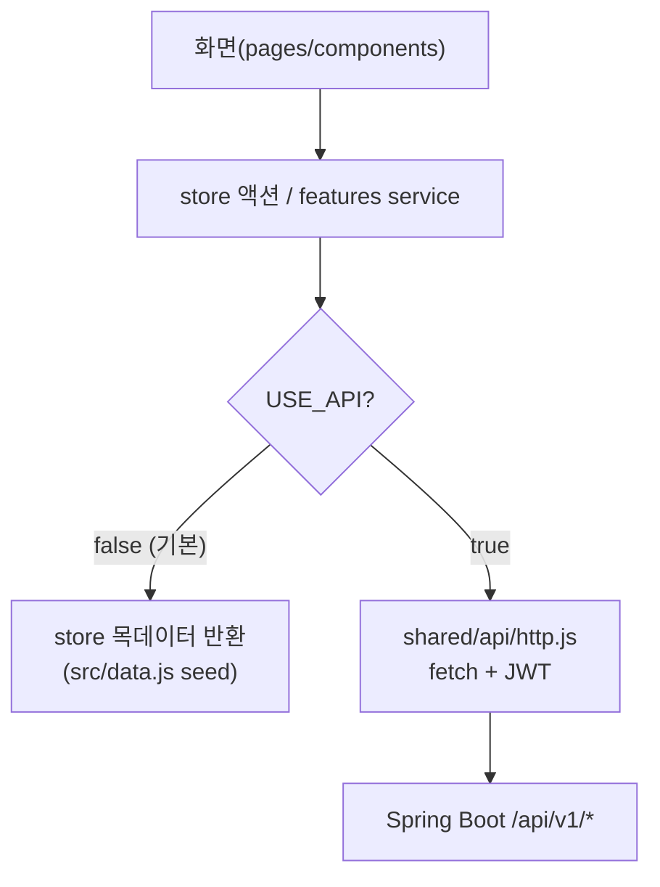
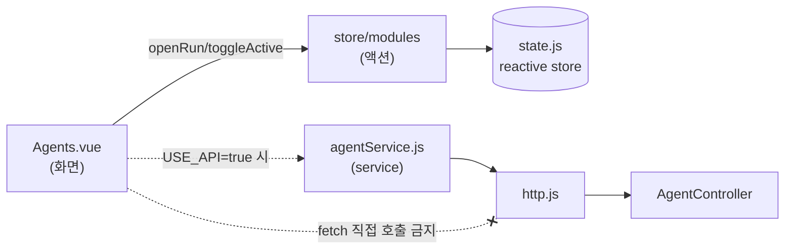
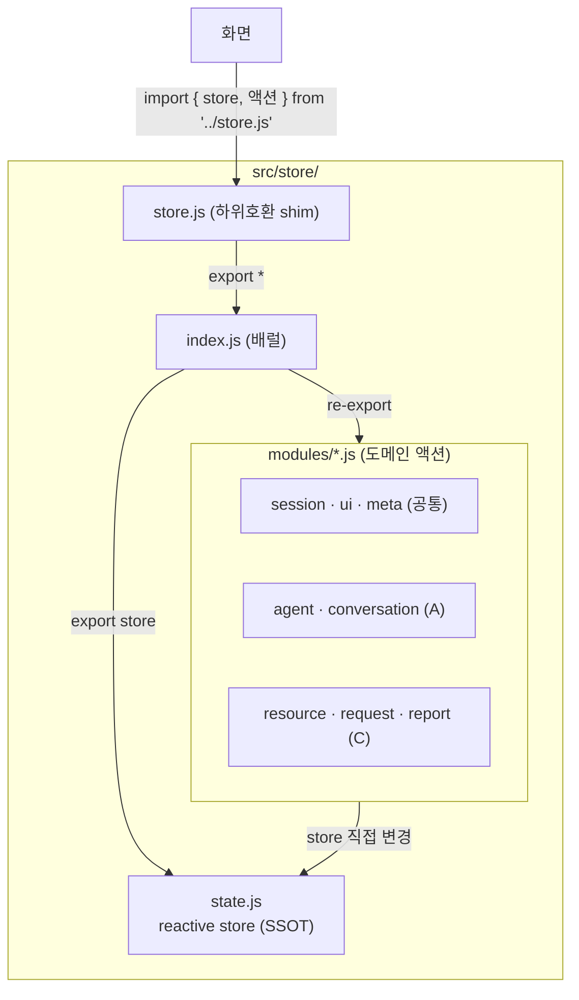
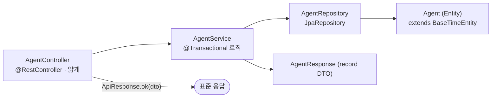
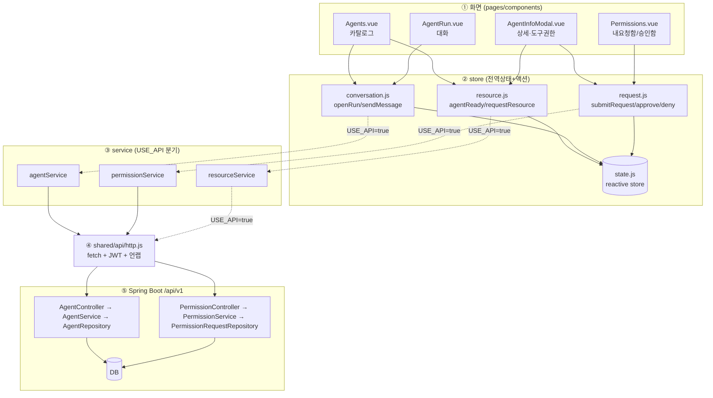
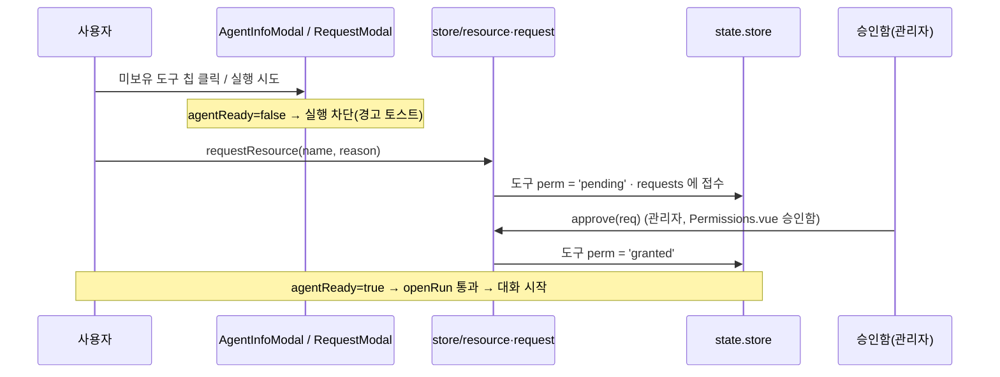

# AX-HUB 사용자 포털 — 아키텍처 문서

> 대상: 이 프로젝트를 이어받아 개발할 **초·중급 개발자**
> 목적: 전체 구조 · 레이어링 · 상태관리 · 풀스택 호출 흐름 · 핵심 업무 규칙 · 담당 배분을 한 문서로 파악한다.
> 원칙: **실제 소스(`src/`, `backend/`)에 존재하는 파일·심볼만** 기술한다. 소스가 정답이며, 이 문서는 그 지도다.

---

## 1. 시스템 개요

신한라이프 **AX-HUB 사용자 포털**은 AI **에이전트**·**지식(RAG)** 카탈로그, **권한 요청→승인** 워크플로우,
**에이전트 채팅 실행**, 관리자용 **시스템 관제(AIOps)** 를 하나의 SPA 로 제공한다.



- **프론트**: 화면 + 경량 상태관리. 현재는 **목(mock) 데이터로 단독 동작**하며, `VITE_USE_API=true` 로 실제 백엔드에 연결한다.
- **백엔드**: REST API. 도메인별 레이어드 구조(Controller → Service → Repository → Entity/DTO).
- **연동 스위치**: `src/shared/api/config.js` 의 `USE_API` **하나로** mock ↔ 실서버를 전환한다.

### USE_API 목/실 전환 원리



`USE_API` 값은 `import.meta.env.VITE_USE_API === 'true'` 로 결정된다(기본값 `false`).
각 `features/*/services/*.js` 는 함수 첫 줄에서 `if (USE_API) return http.get(...)` 로 분기하고,
그렇지 않으면 `store`(목데이터)를 반환한다.

---

## 2. 프론트엔드 폴더 구조 (실제 트리)

```
src/
├─ main.js                 앱 진입 (createApp(App).mount('#app') + styles.css import)
├─ App.vue                 레이아웃 + 간이 라우팅(LNB·헤더·모달·토스트·테마 적용)
├─ styles.css              전역 스타일(디자인 토큰 :root + 4개 테마 오버라이드)
├─ data.js                 목 데이터 seed (seedAgents/seedKnowledge/seedRequests/seedBoards/seedResources/knowledgeTree)
│
├─ shared/                 ★ 공통(플랫폼) — 모든 화면이 공유
│  ├─ api/
│  │  ├─ config.js         USE_API 토글 · API_BASE · TOKEN_KEY
│  │  └─ http.js           fetch 래퍼(JWT 헤더 · 에러 정규화(HttpError) · {success,data,message} 언랩)
│  ├─ constants/enums.js   Perm/PERM_META/ReqStatus/TargetType/Scope/SCOPE_LABEL/Role/ToastKind
│  ├─ utils/format.js      today · nowHHMM · comma · ellipsis
│  └─ models/types.js      JSDoc typedef(Agent/Knowledge/PermRequest/Resource/Conversation)
│
├─ store/                  ★ 전역 상태 + 도메인 액션
│  ├─ state.js             전역 reactive 상태(SSOT) + nextId()
│  ├─ index.js             배럴(모든 modules 재노출)
│  └─ modules/
│     ├─ session.js        go(page)                         (공통)
│     ├─ ui.js             toast · setTheme                 (공통)
│     ├─ meta.js           permMeta · scopeTabs             (공통)
│     ├─ agent.js          toggleActive · addFolder · moveAgentToFolder · toggleFavorite   (A)
│     ├─ conversation.js   openRun · sendMessage · currentConv · new/select/delete/rename/resumeConversation  (A)
│     ├─ resource.js       resourcePerm · resourceOwner · agentReady · requestResource      (C)
│     ├─ request.js        openRequest · submitRequest · cancelRequest · approve · openDeny · confirmDeny · approveAll  (C)
│     └─ report.js         submitReport · start/reply/resolve/cancelReport · reportCat/Status 라벨  (C)
├─ store.js                (하위호환 shim → store/index.js 재노출)
│
├─ features/               ★ 도메인별 백엔드 연동 서비스(연동 seam)
│  ├─ agent/services/agentService.js            (A) → /agents
│  ├─ knowledge/services/knowledgeService.js    (B) → /knowledge
│  ├─ community/services/communityService.js    (D) → /community
│  ├─ permission/services/permissionService.js  (C) → /requests
│  ├─ permission/services/resourceService.js    (C) → /resources
│  ├─ auth/services/authService.js              (E) → /auth
│  ├─ access/services/accessService.js          (C) 결재선/권한 신청(→ /access-requests)
│  └─ chatbot/services/chatbotService.js        (E) 챗봇(→ /chatbot/ask)
│
├─ pages/                  화면 12종 (간이 라우팅 단위)
│  ├─ Home.vue             워크스페이스(홈) 대시보드                     (A)
│  ├─ Agents.vue           에이전트 카탈로그(내/전체/즐겨찾기·폴더·권한요청·실행)  (A)
│  ├─ AgentRun.vue         에이전트 실행/대화(채팅목록·대화창·인사이트·신고)  (A)
│  ├─ ToolManage.vue       툴 관리(도구·미들웨어·스킬·MCP 카탈로그)        (C)
│  ├─ Knowledge.vue        지식(RAG) 카탈로그(트리·카드/리스트·지식채팅)   (B)
│  ├─ Community.vue        라운지/커뮤니티(게시판별 글)                   (D)
│  ├─ Permissions.vue      마이페이지(내 요청함/승인함·신고함)            (C)
│  ├─ AccessRequest.vue    권한 신청(결재선 지정)                         (C)
│  ├─ SysMonitor.vue       시스템 모니터링(KPI·차트)          [관리자]    (D)
│  ├─ ItOps.vue            IT 운영 관리(AIOps 관제 콘솔)      [관리자]    (D)
│  ├─ ComputerUse.vue      현황 전파(Computer-Use 에이전트)   [관리자]    (D)
│  └─ DailyReport.vue      일일점검 보고서(배치형 에이전트)   [관리자]    (D)
│
└─ components/             재사용 컴포넌트
   ├─ Icon.vue             SVG 아이콘(path 딕셔너리, stroke=currentColor)   (E)
   ├─ StatusPill.vue       권한 상태 pill(permMeta 매핑)                    (E)
   ├─ Steps.vue            요청 진행 스텝(제출→검토→완료/반려)             (E)
   ├─ AgentFab.vue         우하단 플로팅 액션(Agent 빌더/지식 생성/챗봇)   (E)
   ├─ AgentInfoModal.vue   에이전트 상세 · 도구 권한 요청                   (A)
   ├─ RequestModal.vue     권한 요청 폼(store.modal)                        (C)
   ├─ DenyModal.vue        반려 사유 입력(store.denyModal)                  (C)
   ├─ ReportModal.vue      신고/개선요청(대화 스크립트 첨부)               (C)
   ├─ ApprovalLine.vue     결재선 스텝퍼(v-model 재사용)                   (C)
   ├─ FolderPickerModal.vue 폴더 이동(그룹화)                              (A)
   ├─ PromptDialog.vue     공통 한 줄 입력 팝업(폴더 생성/이름변경)        (E)
   ├─ KnowledgeChat.vue    지식 RAG 채팅                                   (B)
   ├─ KnowledgeTreeNode.vue 재귀 카테고리 트리 노드                        (B)
   ├─ DetailModal.vue      차트/패널 상세 리스트 팝업(공용)                (D/E)
   ├─ ChatbotModal.vue     간단 Q&A 챗봇 팝업(chatbotService)              (E)
   ├─ BuilderModal.vue     외부 빌더 새 창 런처                            (E)
   ├─ CardRail.vue         dynamic 테마 가로 스크롤 캐러셀 래퍼            (디자이너/E)
   ├─ SettingsModal.vue    디자인 테마(5종) 전환                           (E)
   └─ AgentInfoModal … 등  (상세는 각 파일 상단 주석 참고)
```

### 간이 라우팅 (App.vue)

vue-router 없이 `store.page`(문자열 키)로 화면을 전환한다. 핵심 3요소를 **함께** 갱신해야 한다.

| 위치 | 역할 |
|------|------|
| `pages` 객체 | page 키 → 화면 컴포넌트 매핑 (`home/agents/tools/knowledge/perms/community/run/access/sysmon/itops/computeruse/daily`) |
| `titleMap` | page 키 → 헤더 타이틀 |
| `nav`(computed) | LNB 메뉴 트리. `store.role === 'admin'` 일 때만 `시스템 관리`·`승인함` 노출 |

- 화면 이동은 `go(page)`(`store/modules/session.js`) 로 `store.page` 를 바꾼다.
- 라운지(커뮤니티) 하위 메뉴는 `store.boards` 의 게시판 id 를 page 키로 쓰며, 그 id 는 `Community.vue` 로 라우팅된다.
- `AgentFab` 는 관제 화면(`sysmon/itops/computeruse/daily`)에서는 숨긴다.

---

## 3. 레이어링 규칙 (반드시 지킬 것)

```
화면(pages/components)  →  store(액션) / features service  →  shared/api(http.js)  →  백엔드(/api/v1)
```

1. **화면은 store 상태를 읽고, 액션/service 를 호출만** 한다. → 화면에서 `fetch` 직접 호출 **금지**.
2. **백엔드 통신은 `features/*/services` 안에서만** 한다. (`USE_API` 분기 지점이 여기 한 곳)
3. **공통 영역(shared · store 코어 · 공통 컴포넌트 · styles.css)** 변경은 **개발자 E 리뷰 필수**.
4. 매직 문자열 금지 → 상태/권한/역할 값은 `shared/constants/enums.js` 상수를 쓴다.



---

## 4. 상태관리 구조

Vue `reactive` 기반 **경량 스토어**다. (규모가 커지면 Pinia 이관 권장 — 각 필드는 state, 모듈 액션은 actions 로 매핑.)



- **`state.js` = Single Source of Truth.** 앱 전체가 공유하는 하나의 `reactive` 객체.
  주요 필드: `user · role · page · permsView` / `agents · folders · knowledge · requests · reports · boards · resources` /
  `modal · denyModal · toasts · theme` / `currentAgent · conversations · currentConvId`.
  임시 id 는 `nextId()`(전역 순번)로 발급.
- **`modules/*.js`** = 도메인별 액션. `store` 를 직접 변경하고, reactive 이므로 화면이 자동 재렌더된다.
- **`index.js`** = 배럴. `store` 와 모든 모듈 액션을 한 곳에서 재노출.
- **`store.js`** = 하위호환 shim. 기존 화면들이 `'../store.js'` 로 import 하므로 유지(내부는 `index.js` 재노출).

> 신규 코드는 `'../store.js'`(shim) 또는 `'@/store'`(배럴) 어디서 import 해도 동일하게 동작한다.

---

## 5. 백엔드 패키지 구조

**Spring Boot 3.2.5 · Java 17 · JPA/Hibernate · Spring Security · JWT(jjwt) · H2(개발).** 실행: `./gradlew bootRun` (`:8080`).

```
backend/src/main/java/com/axhub/
├─ AxhubApplication.java         진입점 (@SpringBootApplication · @EnableJpaAuditing)
├─ common/                       ★ 공통(개발자 E)
│  ├─ response/ApiResponse       {success, data, message} 표준 응답 (ok/fail)
│  ├─ exception/
│  │  ├─ BusinessException       예상된 업무 예외(status + badRequest()/notFound())
│  │  └─ GlobalExceptionHandler  @RestControllerAdvice 로 표준 실패 응답 변환
│  ├─ config/SecurityConfig      JWT·CORS(현재 anyRequest().permitAll() — 인증 담당이 확장)
│  └─ entity/BaseTimeEntity      createdAt·updatedAt 자동 기록(@MappedSuperclass)
├─ agent/        ✅ 레퍼런스 (개발자 A)
│  ├─ AgentController            GET /agents · /{id} · PATCH /{id}/active · /{id}/favorite
│  ├─ AgentService               @Transactional 로직(findOrThrow → 404)
│  ├─ AgentRepository            JpaRepository<Agent, String>
│  ├─ domain/Agent               엔티티(도구 목록은 agent_tool 컬렉션 테이블), 도메인 로직(toggleActive 등)
│  └─ dto/AgentResponse          record DTO (from(Agent))
├─ permission/   ✅ 레퍼런스 (개발자 C)
│  ├─ PermissionController       GET /requests?scope · POST /requests · /{id}/approve · /{id}/deny · DELETE /{id}
│  ├─ PermissionService          생성/목록(내 요청함·승인함)/승인/반려/취소
│  ├─ PermissionRequestRepository findByRequester… 파생 쿼리
│  ├─ domain/PermissionRequest   엔티티(status pending→approved/denied, denyReason)
│  └─ dto/CreateRequestDto · RequestResponse  (@Valid 검증 · record 응답)
├─ resource/     🔧 스캐폴드 (개발자 C)  ResourceController (/resources/me · /{name}/request)
├─ knowledge/    🔧 스캐폴드 (개발자 B)  KnowledgeController (/knowledge · /categories · /{id})
├─ community/    🔧 스캐폴드 (개발자 D)  CommunityController (/community/boards · /boards/{id}/posts)
└─ auth/         🔧 스캐폴드 (개발자 E)  AuthController (/auth/login · /auth/me)
```

### 백엔드 레이어(에이전트 도메인 = 정답지)



- **컨트롤러는 얇게**, 실제 로직/트랜잭션은 서비스, DB 접근은 리포지토리, 도메인 규칙은 엔티티 안에.
- **엔티티 직접 노출 금지** → `record` DTO 로 변환(`AgentResponse.from(...)`).
- 응답은 항상 `ApiResponse.ok(...)`, 예상된 오류는 `BusinessException`(→ GlobalExceptionHandler 가 `{success:false,message}` 로 변환).
- `agent` · `permission` 두 도메인을 **"정답지"** 로 보고 나머지 스캐폴드(🔧)를 동일 패턴으로 채운다.

> 응답 계약: 프론트 `http.js` 가 `{success,data,message}` 를 인지해 `data` 만 언랩한다. → 프론트/백엔드 응답 형태가 한 가지로 통일된다.

---

## 6. 풀스택 호출 관계도 (대표 흐름 2개)

가장 완성도 높은 두 흐름(**에이전트 실행**, **도구 권한 요청→승인**)을 예로 든다.



> 현재 기본값 `USE_API=false` 에서는 store 액션이 `state.js`(목데이터)만 갱신한다.
> `USE_API=true` 로 켜면 각 service 가 `http.js` 를 통해 대응 Controller 를 호출한다(점선).

---

## 7. 핵심 업무 규칙 (도메인 로직)

> **에이전트는 누구나 생성·사용할 수 있으나, 에이전트가 쓰는 도구(리소스)를 하나라도 보유하지 않으면 실행할 수 없다.**

- 실행 가능 여부 = **`agentReady(agent)`** = `agent.tools` 가 **전부** `granted`
  (`store/modules/resource.js`: `(agent?.tools || []).every(t => resourcePerm(t) === 'granted')`).
- 미보유(`none`/`denied`) 도구 → **권한 요청**(`requestResource`) → 도구 `pending` + `store.requests` 에 접수 →
  운영 관리자 **승인**(`approve`) → 도구 `granted` → `agentReady=true` → **실행 버튼 활성화**.
- 권한 상태(`enums.Perm`): `owner`(내 소유) · `granted`(보유) · `pending`(요청중) · `none`(미보유) · `denied`(반려) · `expired`(만료).



**에이전트 실행(대화) 흐름:**
`Agents.vue → openRun(agent)`(conversation.js) → `agentReady` 통과 시 `currentAgent`·`conversations` 세팅 후
`store.page='run'` → `AgentRun.vue` 가 `currentConv()` 렌더 → `sendMessage(text)` 가 목 응답을 스트리밍처럼 표시하고 `agent.runs++`.
(실연동 시 `sendMessage` 내부를 백엔드 스트리밍 API(SSE/WebSocket)로 교체.)

---

## 8. 팀 담당 배분 (개발자 5 + 디자이너/퍼블리셔)

| 담당 | 프론트 화면/모듈 | store / service | 백엔드 도메인 |
|------|------------------|-----------------|----------------|
| **개발자 A** — 에이전트 | Home · Agents · AgentRun, AgentInfoModal · FolderPickerModal | store `agent`·`conversation`, `agentService` | `agent` ✅ |
| **개발자 B** — 지식 | Knowledge, KnowledgeChat · KnowledgeTreeNode | `knowledgeService` | `knowledge` 🔧 |
| **개발자 C** — 권한 | Permissions · AccessRequest · ToolManage, RequestModal · DenyModal · ReportModal · ApprovalLine | store `request`·`resource`·`report`, `permissionService`·`resourceService`·`accessService` | `permission` ✅ · `resource` 🔧 |
| **개발자 D** — 커뮤니티+시스템관리 | Community · SysMonitor · ItOps · ComputerUse · DailyReport, DetailModal | `communityService` | `community` 🔧 · 모니터링 API |
| **개발자 E** — 플랫폼/공통 | `shared/*`, store 코어(state·index·ui·session·meta), 공통 컴포넌트(Icon·StatusPill·Steps·DetailModal·SettingsModal·AgentFab·PromptDialog·ChatbotModal·BuilderModal), 인증, 빌드/배포 | `authService`·`chatbotService` | `common` · `auth` 🔧 |
| **디자이너·퍼블리셔** | `styles.css` 디자인 시스템, 5개 테마, 컴포넌트 스타일, 반응형, 접근성(a11y) | — | — |

✅ 레퍼런스 구현 · 🔧 스캐폴드(레퍼런스 패턴으로 채우기)

### 협업 규칙

1. **공통 영역(shared · store 코어 · 공통 컴포넌트 · styles.css) 변경은 개발자 E 리뷰 필수.**
2. 각 담당은 자기 `features/<도메인>` · 담당 `pages/components` · 백엔드 `<도메인>` 패키지 안에서 작업한다.
3. 새 API 는 **프론트 service ↔ 백엔드 controller 를 같은 PR** 로 반영한다.
4. 디자인 토큰/테마 변경은 디자이너·퍼블리셔가 주도하되, 클래스 삭제·구조 변경은 관련 화면 담당과 합의한다.

---

## 9. 코딩 컨벤션

**공통**
- 파일 상단 주석에 역할 + `[담당: 개발자 X]` 를 명시한다.
- 매직 문자열 금지 → `shared/constants/enums.js` 사용. 날짜/숫자 표시 → `shared/utils/format.js` 사용.

**프론트(Vue 3)**
- `<script setup>` + Composition API 표준.
- 화면은 store 상태를 읽고 액션 호출만. 비동기 통신은 service 로.
- 컴포넌트/파일: PascalCase(`AgentInfoModal.vue`), 변수/함수: camelCase.
- **SVG 차트/그래프의 `stroke`·`fill`·`stop-color` 등 presentation 속성에는 CSS 변수(`var(--x)`)가 통하지 않으므로 CI 팔레트 hex 를 직접 쓴다** (예: `ItOps.vue`·`SysMonitor.vue` 의 `#0046FF`/`#0E8A66`/`#D2403A`). 일반 요소 스타일은 반드시 토큰 변수를 쓴다.

**백엔드(Spring)**
- 컨트롤러는 얇게, 로직은 서비스, DB 접근은 리포지토리, 도메인 규칙은 엔티티.
- 엔티티 직접 노출 금지 → `record` DTO 변환. 응답은 `ApiResponse.ok(...)`, 예외는 `BusinessException`.
- 조회는 `@Transactional(readOnly=true)`, 변경은 `@Transactional`.

---

## 10. 디자인 테마 (5종)

`SettingsModal.vue`(우측 상단 설정 ⚙)에서 전환한다. `store.theme` → `App.vue` 가 `document.documentElement` 의 `data-theme` 속성을 갱신 →
`styles.css` 의 오버라이드가 전 화면에 즉시 반영되고 `localStorage('ax-theme')` 로 유지된다.

| 테마 키 | 이름 | 특징 | styles.css |
|---------|------|------|------------|
| `default` | 기본 (신한 CI) | 표준 반응형 그리드 · 신한 블루 | 기본 `:root` 토큰 |
| `bento` | 베토 그리드 | 크기 다른 파스텔 타일 매트릭스 | `:root[data-theme="bento"]` |
| `dynamic` | 다이나믹 카드 | 넷플릭스식 가로 스크롤 레일(`CardRail.vue`) · 그라데이션 | `:root[data-theme="dynamic"]` |
| `minimal` | 미니멀 | 플랫 리스트 행 · 모노톤 | `:root[data-theme="minimal"]` |
| `dark` | 다크 | 다크 대시보드 · 네온 글로우 | `:root[data-theme="dark"]` |

---

## 11. 실행 방법

```bash
# 프론트 (Node 18+)
npm install
npm run dev        # http://localhost:5173  (vite.config.js: server.port 5173)
npm run build      # 프로덕션 빌드 → dist/  (base './')

# 백엔드 (JDK 17)
cd backend
./gradlew bootRun  # http://localhost:8080  (H2 콘솔: /h2-console)

# 실서버 연동: 프로젝트 루트에 .env
#   VITE_USE_API=true
#   VITE_API_BASE=http://localhost:8080/api/v1
```

기본값(`.env` 없음)은 `USE_API=false` 이므로 **프론트만으로 목데이터 데모**가 가능하다.
`application.yml` 의 CORS 는 `http://localhost:5173`(프론트 dev 서버)를 허용한다.

---

## 12. API 목록 (프론트 service ↔ 백엔드 controller)

| 기능 | 메서드 · 경로 | 프론트 service | 백엔드 |
|------|---------------|----------------|--------|
| 에이전트 목록/상세 | GET `/agents` · `/agents/{id}` | agentService | AgentController ✅ |
| 에이전트 활성/즐겨찾기 | PATCH `/agents/{id}/active` · `/favorite` | agentService | AgentController ✅ |
| 요청 목록 | GET `/requests?scope=mine\|approve` | permissionService | PermissionController ✅ |
| 요청 생성 | POST `/requests` | permissionService | PermissionController ✅ |
| 승인/반려/취소 | POST `/requests/{id}/approve` · `/deny`, DELETE `/requests/{id}` | permissionService | PermissionController ✅ |
| 내 도구 권한 | GET `/resources/me` | resourceService | ResourceController 🔧 |
| 도구 권한 요청 | POST `/resources/{name}/request` | resourceService | ResourceController 🔧 |
| 지식 목록/카테고리/상세 | GET `/knowledge` · `/knowledge/categories` · `/knowledge/{id}` | knowledgeService | KnowledgeController 🔧 |
| 커뮤니티 | GET `/community/boards` · `/boards/{id}/posts` | communityService | CommunityController 🔧 |
| 인증 | POST `/auth/login`, GET `/auth/me` | authService | AuthController 🔧 |
| 권한 신청(결재선) | POST `/access-requests` | accessService | (미구현 — 프로세스 확정 후) |
| 챗봇 | POST `/chatbot/ask` | chatbotService | (미구현) |

✅ 레퍼런스 구현 · 🔧 스캐폴드(동일 패턴으로 채우기)
