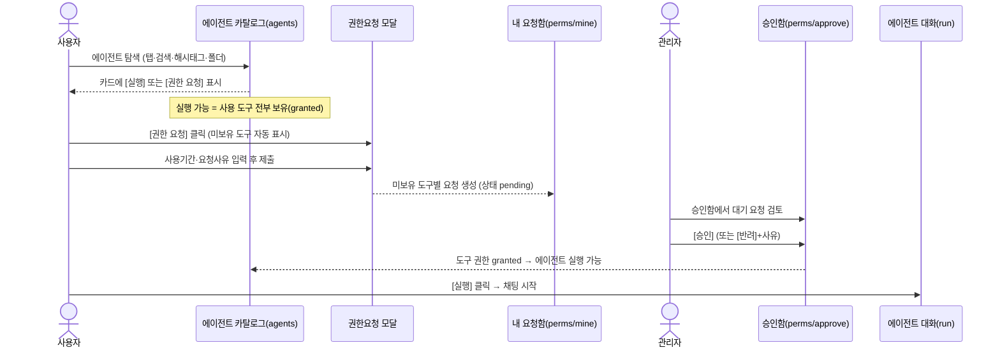
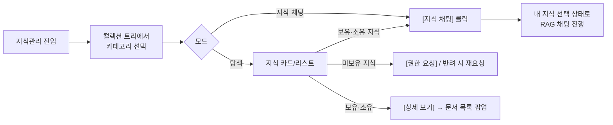
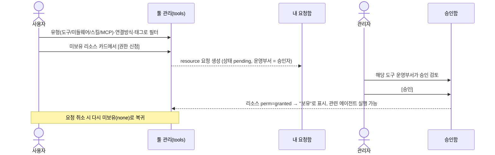
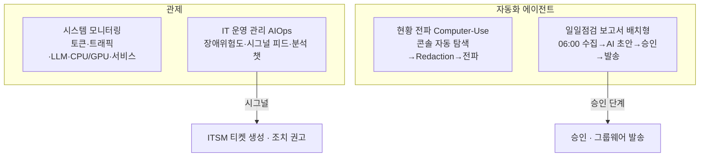
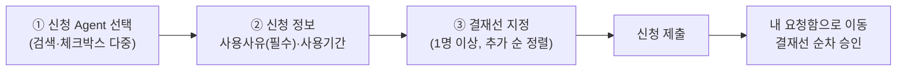
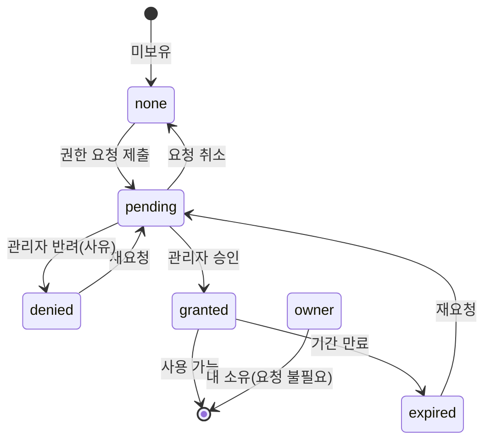

# AX-HUB 사용자 포털 — 서비스 기획서

> 신한라이프 · 현대모비스 **AX-HUB 사용자 포털** 프로토타입 기획/설계 문서
> 대상 독자: 기획자 · 디자이너 · 초급 개발자 (함께 보는 문서)
> 기준 소스: `src/App.vue`, `src/data.js`, `src/pages/*`, `src/store/*` (2026-07 기준)
> 본 문서는 실제 소스에 구현된 화면·기능만 기술합니다. (현재는 **목(mock) 데이터 기반 프로토타입** — 백엔드 미연동)

---

## 1. 서비스 개요

**AX-HUB 사용자 포털**은 사내 임직원이 업무용 AI 에이전트와 지식(RAG)을 한 곳에서 찾고, 권한을 신청·승인받아, 바로 채팅으로 실행하고, 시스템 상태까지 관제하는 **사내 AI 통합 포털**입니다.

### 무엇을 하는 서비스인가

| 축 | 설명 |
|---|---|
| **에이전트 카탈로그** | 업무별 AI 에이전트를 탐색·즐겨찾기·폴더 정리하고, 권한이 있으면 실행(채팅)합니다. |
| **지식(RAG) 카탈로그** | 부서·전사 지식 컬렉션을 계층 트리로 탐색하고, 보유한 지식으로 "지식 채팅"을 합니다. |
| **도구/리소스 관리** | 에이전트가 쓰는 도구·미들웨어·스킬·MCP를 카탈로그에서 확인하고 권한을 신청합니다. |
| **권한 요청/승인** | 에이전트·지식·도구에 대한 권한을 신청하고, 관리자가 승인·반려합니다. (결재선 지정 지원) |
| **에이전트 채팅 실행** | 권한이 확보된 에이전트와 대화하며, 사용 인사이트·연결 지식·신고(개선요청)를 함께 제공합니다. |
| **시스템 관제 (관리자)** | 시스템 모니터링 · AIOps 장애예측 · 현황 자동 전파(Computer-Use) · 일일점검 보고서(배치)를 관리합니다. |

### 핵심 설계 원칙 (프로젝트의 중심 규칙)

> **"에이전트는 누구나 만들고 볼 수 있지만, 에이전트가 사용하는 도구·스킬·지식 리소스를 하나라도 보유하지 않으면 실행할 수 없다."**

즉 **에이전트 실행 가능 여부 = 에이전트가 쓰는 모든 도구의 권한 보유 여부**로 결정됩니다. (`agentReady` = 사용 도구 전부 `granted`)

### 대상 사용자 · 핵심 가치

- **일반 사용자(임직원):** 흩어진 AI 자산을 한 화면에서 찾고, 권한만 받으면 즉시 업무에 활용.
- **관리자/권한자:** 권한 요청·개선요청을 검토·처리하고, AI 인프라 상태를 관제.
- **핵심 가치:** 발견성(카탈로그) · 통제(권한/ABAC) · 즉시 실행(채팅) · 운영 가시성(관제)을 하나의 포털로 통합.

---

## 2. 사용자 역할 정의

역할은 `store.role` = `user` | `admin` 두 가지이며, 헤더 우측의 **역할 전환 토글(데모용)**로 즉시 바꿀 수 있습니다. (실서비스에서는 로그인 계정 권한으로 대체)

| 구분 | 일반 사용자 (user) | 관리자 (admin) |
|---|---|---|
| 에이전트 탐색·즐겨찾기·폴더 정리 | ✅ | ✅ |
| 에이전트 실행(채팅) | ✅ (권한 보유 시) | ✅ |
| 지식 탐색·지식 채팅 | ✅ (보유 지식) | ✅ |
| 도구/지식/에이전트 권한 **신청** | ✅ | ✅ |
| 신고(개선요청) 접수 | ✅ | ✅ |
| **내 요청함**(내 요청·신고 추적) | ✅ | ✅ |
| **승인함**(타인 요청 승인/반려) | ❌ | ✅ |
| 신고 **처리**(진행·답변·완료) | ❌ | ✅ |
| **시스템 관리** 메뉴 전체 | ❌ | ✅ |

**관리자만 노출되는 것:** 마이페이지 하위 `승인함`, 그리고 `시스템 관리` 메뉴 그룹(시스템 모니터링 / IT 운영 관리 / 현황 전파 / 일일점검 보고서). — `src/App.vue`의 `nav` computed에서 `store.role === 'admin'`일 때만 추가됩니다.

---

## 3. 정보 구조(IA) / 메뉴 트리

`src/App.vue`의 좌측 LNB(주 메뉴) 기준 전체 구조입니다. 메뉴는 아코디언(한 번에 하나만 펼침)이며, 라운지는 기본 확장 상태입니다.

```
AX-HUB 사용자 포털 (좌측 LNB)
├─ 홈                         (home)
├─ 에이전트                    ▸ 그룹
│   ├─ 에이전트 카탈로그        (agents)  ── 실행 화면(run)과 연결
│   └─ 툴 관리                 (tools)
├─ 지식관리                    (knowledge)
├─ 라운지                      ▸ 그룹 (게시판 = store.boards)
│   ├─ 공지사항                (notice)
│   ├─ 활용 가이드             (guide)
│   ├─ Q&A                    (qna)
│   ├─ FAQ                    (faq)
│   ├─ 라운지                  (lounge)
│   └─ 우수 활용사례           (best)
├─ 마이페이지                  ▸ 그룹
│   ├─ 내 요청함               (perms · view=mine)
│   └─ 승인함                  (perms · view=approve)      🔒 관리자 전용
└─ 시스템 관리                 ▸ 그룹                        🔒 관리자 전용
    ├─ 시스템 모니터링          (sysmon)
    ├─ IT 운영 관리            (itops)
    ├─ 현황 전파               (computeruse)
    └─ 일일점검 보고서          (daily)
```

**메뉴에 없지만 존재하는 화면:** `권한 신청`(page=`access`)은 LNB 항목이 아니라, 사이드바 하단 **추천 자료 → "권한 신청 방법"** 등에서 진입하는 별도 화면입니다. (에이전트 다건을 선택해 결재선 지정으로 신청)

**전역 UI 요소**
- **글로벌 헤더:** 현재 화면 타이틀(`titleMap`) · 알림 · 설정(테마) · 역할 전환 토글 · 프로필(`김신한 · 영업추진팀`).
- **플로팅 생성 버튼(AgentFab):** 우측에 떠 있는 "만들기" 버튼(Agent 빌더 / 지식 생성 / 챗봇). 시스템 관리 화면(sysmon·itops·computeruse·daily)에서는 숨김.
- **설정 팝업(테마):** 5개 디자인 시안 — `기본(신한 CI)` / `베토 그리드` / `다이나믹 카드` / `미니멀` / `다크`. 선택 즉시 전체 적용 + localStorage 유지.
- **공통 모달:** 권한요청 · 반려사유 입력 · 상세 리스트 · 토스트 알림.

---

## 4. 화면 목록 표

12개 화면 전체입니다. (경로키 = `store.page` 값)

| # | 화면명 | 경로키(page) | 한 줄 목적 | 접근 역할 |
|---|---|---|---|---|
| 1 | 홈(워크스페이스) | `home` | 내 에이전트·워크스페이스·현황·커뮤니티 요약 대시보드 | user · admin |
| 2 | 에이전트 카탈로그 | `agents` | 에이전트 탐색/필터/즐겨찾기/폴더 + 실행·권한요청 | user · admin |
| 3 | 에이전트 대화(실행) | `run` | 선택 에이전트와 채팅 실행 + 인사이트·신고 | user · admin |
| 4 | 지식관리 | `knowledge` | 지식 컬렉션 트리 탐색 + 지식 채팅(RAG) | user · admin |
| 5 | 툴 관리 | `tools` | 도구·미들웨어·스킬·MCP 카탈로그 + 권한 신청 | user · admin |
| 6 | 라운지(게시판) | `notice`·`guide`·`qna`·`faq`·`lounge`·`best` | 공지·가이드·Q&A·FAQ·소통·우수사례 게시판 | user · admin |
| 7 | 마이페이지(요청함/승인함) | `perms` | 내 권한요청·신고 추적 / (관리자)승인·신고처리 | user(내 요청함) · admin(전체) |
| 8 | 권한 신청 | `access` | 에이전트 다건 선택 + 결재선 지정 신청 | user · admin |
| 9 | 시스템 모니터링 | `sysmon` | 토큰·트래픽·LLM·CPU/GPU·서비스 상태 관제 | admin |
| 10 | IT 운영 관리(AIOps) | `itops` | 장애예측 대시보드 + 실시간 시그널 + 분석 챗 | admin |
| 11 | 현황 전파 | `computeruse` | Computer-Use 에이전트의 자동 탐색·전파 | admin |
| 12 | 일일점검 보고서 | `daily` | 배치형 에이전트의 점검 보고서 생성·승인·발송 | admin |

---

## 5. 핵심 사용자 시나리오(플로우)

### 시나리오 A — 에이전트 탐색 → 권한요청 → 승인 → 실행

에이전트 자체가 아니라 **에이전트가 쓰는 도구 권한**을 요청하는 것이 핵심입니다.



핵심 규칙: 에이전트 카드 버튼은 **① 실행 가능(도구 전부 보유) → [실행]**, **② 미보유 도구가 모두 요청중 → [요청중](비활성)**, **③ 그 외 → [권한 요청]** 세 가지로 자동 분기합니다.

### 시나리오 B — 지식 채팅 (RAG)



- 지식 채팅 대상은 **보유(granted) 또는 소유(owner) 지식**만입니다. 미보유 지식은 채팅 대신 권한 요청 버튼이 노출됩니다.

### 시나리오 C — 툴 관리에서 도구 권한 신청



### 시나리오 D — 관리자 시스템 관제 & 일일점검



### 시나리오 E — 권한 신청(결재선 지정)

`access` 화면은 여러 에이전트를 한 번에 선택하고 **결재선(승인 라인)**을 순차 지정해 신청합니다.



---

## 6. 화면별 기획 상세 (12개)

각 화면: **목적 / 주요 UI 구성요소 / 사용자 행동 / 상태·예외** 순.

### 6-1. 홈 · 워크스페이스 (`home`)

- **목적:** 로그인 후 첫 화면. 내 AI 자산과 커뮤니티 소식을 한눈에 요약.
- **주요 UI:** 상단 등록 건수 → 좌측 메인(① My Agent 폴더 트리 + 검색, ② Work Space 카드, ③ 액션 타일[에이전트 직접 만들기·가져오기·즐겨찾기], ④ 현황 스탯 4종[나의 에이전트/승인된 에이전트/권한요청 지식/권한요청 도구]) / 우측 커뮤니티 컬럼 4종(공지·커뮤니티·문의/오류·사용자가이드).
- **사용자 행동:** 카드·타일 클릭 → 대부분 에이전트 카탈로그(`agents`)로, 커뮤니티 컬럼 → 라운지(`community`)로 이동.
- **상태·예외:** 현재 홈의 트리/카드/컬럼은 **화면 확인용 샘플 데이터**로, 실제로는 agentService·communityService로 대체 예정(주석 명시).

### 6-2. 에이전트 카탈로그 (`agents`)

- **목적:** 전사 에이전트를 탐색하고, 실행 또는 권한 요청.
- **주요 UI:** 상단 탭(내 Agent / 전체 Agent / 즐겨찾기 + 카운트) · 검색 · 상태 필터(전체/실행 가능/도구 권한 필요) · 보기 토글(카드/리스트) · 폴더 그룹 바(+새 폴더) · 도구명 기반 해시태그 검색 · 폴더별 그룹 섹션.
- **카드 요소:** 즐겨찾기(★), 이름·설명·도구 태그, 소유 토글(내 소유), 폴더 이동, 공유 횟수, 그리고 상태별 액션 버튼.
- **사용자 행동:** 카드 클릭 → 에이전트 정보 모달 / [실행] → 대화 화면(run) / [권한 요청] → 요청 모달 / 별 → 즐겨찾기 / 폴더 칩 → 폴더 이동·새 폴더 생성 / 내 소유 토글 → 활성·비활성.
- **상태·예외:** 실행 버튼은 `실행 가능 / 요청중(비활성) / 권한 요청` 3분기. 내 소유라도 **비활성**이면 실행 불가. 결과 없으면 빈 상태 안내(즐겨찾기 없음/조건 불일치).

### 6-3. 에이전트 대화 · 실행 (`run`)

- **목적:** 선택한 에이전트와 채팅으로 업무 수행.
- **주요 UI(3분할):** ① 좌 채팅 목록(새 채팅·검색·목록·빈 상태, 항목 메뉴로 이름변경/삭제) ② 중 대화창(에이전트 헤더·메시지 버블·타이핑 인디케이터·추천 질문 칩·입력창·하단 툴바 아이콘·토큰/비용 사용량 표시) ③ 우 인사이트 패널(에이전트 정보·권한(ABAC)·사용 인사이트·연결 지식(RAG)·관련 가이드/사례, 접기 가능).
- **사용자 행동:** 메시지 전송(목 응답을 스트리밍처럼 재생), 새 채팅/이어가기/이름변경/삭제, [신고하기]로 개선요청 접수(대화 스크립트 스냅샷 첨부).
- **상태·예외:** 응답 생성 중(busy)에는 입력·전송 비활성. 선택 에이전트가 없으면 "실행할 Agent가 선택되지 않았습니다" 안내 + 카탈로그 이동. 최초 진입 시 추천질문 기반 과거 대화가 시드됨.

### 6-4. 지식관리 (`knowledge`)

- **목적:** 지식 컬렉션 계층을 탐색하고, 보유 지식으로 RAG 채팅.
- **주요 UI:** 상단 통합 검색 + 모드 토글(탐색 / 지식 채팅) · 좌측 컬렉션 트리(전사 공통·영업/마케팅·상품·심사/보상·재무/회계·고객/CS·IT·개인, 하위 카운트 합산) · 우측 지식 목록(카드/리스트) · 지식 채팅 패널.
- **카드 요소:** 이름·공개범위(개인/팀/부서/전사)·소유부서·설명·문서수·연결 Agent·최신화일·권한 상태 pill.
- **사용자 행동:** 트리로 카테고리 선택, 보유·소유 지식은 [상세 보기](문서 목록 팝업)·[지식 채팅], 요청중은 [요청 취소], 미보유는 [권한 요청]/반려 시 [재요청].
- **상태·예외:** 지식 채팅은 **내 지식(보유/소유)**만 대상. 컬렉션에 지식이 없으면 빈 상태 안내.

### 6-5. 툴 관리 (`tools`)

- **목적:** 에이전트가 쓰는 리소스(도구·미들웨어·스킬·MCP)를 확인하고 권한 신청.
- **주요 UI:** 상단 탭(내가 사용할 수 있는 목록 / 전체 목록) · 유형 탭(전체/도구/미들웨어/스킬/MCP + 카운트) · 검색 · 보기 토글 · 연결 방식 칩(built-in/custom/http/mcp-http/mcp-stdio) · 태그 칩 · 전체 목록은 워크스페이스(AX 플랫폼/업무 부서/인프라·협업) 섹션으로 그룹화.
- **카드 요소:** 유형 아이콘·유형 라벨·연결 방식 배지·태그·운영부서·권한 상태(보유/요청중/미보유).
- **사용자 행동:** 미보유 카드에서 [권한 신청](반려 시 [재요청]), 요청중은 [요청 취소].
- **상태·예외:** 미등록 도구는 기본 보유로 간주. 도구 승인자 = 해당 리소스 운영부서. 조건 불일치 시 빈 상태.

### 6-6. 라운지 · 게시판 (`notice`/`guide`/`qna`/`faq`/`lounge`/`best`)

- **목적:** 공지·활용 가이드·Q&A·FAQ·자유 소통·우수 활용사례 커뮤니티.
- **주요 UI:** 게시판 헤더(이름·설명·[글 작성]) · 공지 게시판은 상단 공지 스트립 · 게시글 목록(제목·작성자·날짜·조회수).
- **사용자 행동:** 사이드바에서 게시판 선택(각 게시판 id가 곧 page), 글 작성(데모 토스트), 게시글에 연결된 에이전트가 있으면 [관련 Agent 실행].
- **상태·예외:** 연결 에이전트 사용 권한이 없으면 "권한이 없습니다. 카탈로그에서 요청하세요" 경고. 글 없으면 빈 상태.

### 6-7. 마이페이지 · 내 요청함 / 승인함 (`perms`)

- **목적:** 내 권한요청·신고 추적(사용자) / 타인 요청 승인·신고 처리(관리자). 좌측 메뉴(`permsView`)가 내 요청함(mine) / 승인함(approve)을 결정.
- **주요 UI:** 탭(권한 / 신고함) · 검색 · 상태 필터(전체/요청중/승인/반려) · 기간 조회 · 보기 토글 · 진행 스텝(Steps) · (관리자)일괄 승인 버튼.
- **사용자 행동(내 요청함):** 요청·신고 상태 확인, 요청중 [요청 취소], 신고 접수건 [신고 취소].
- **관리자 행동(승인함):** [승인]/[반려](사유 필수)/[대기 N건 일괄 승인], 신고 처리(진행 시작 → 답변 → 개선 완료).
- **상태·예외:** 권한 승인은 ABAC 정책에 반영, 모든 이력은 감사 로그에 기록(안내 문구). 항목 없으면 역할별 빈 상태 안내.

### 6-8. 권한 신청 (`access`)

- **목적:** 여러 에이전트를 한 번에 선택하고 결재선을 지정해 사용 권한 신청.
- **주요 UI:** ① 신청 Agent(검색·체크박스 다중 선택) ② 신청 정보(사용 사유[필수]·사용 기간) ③ 결재선 지정(신청자 + 승인자 후보, 1명 이상, 추가 순 정렬) · 하단 [취소]/[신청 제출].
- **사용자 행동:** 에이전트 선택 → 사유·기간 입력 → 결재선 구성 → 제출 → 내 요청함으로 이동.
- **상태·예외:** Agent 미선택/사유 미입력/결재선 0명 시 각각 경고 토스트. [초기화]로 폼 리셋.

### 6-9. 시스템 모니터링 (`sysmon`) · 🔒관리자

- **목적:** OCP 운영 환경의 에이전트 플랫폼 관제.
- **주요 UI:** KPI 6종(토큰 사용량·트래픽·평균 수행시간·서비스 요청·LLM 호출·오류율) · 토큰/트래픽 24h 라인 차트 · LLM 모델별 사용 비중 바 · 노드별 CPU/GPU/MEM 게이지 · Agent 서비스 상태 표(네임스페이스·파드·p95·RPS·정상/주의/중단).
- **사용자 행동:** 차트·패널 타이틀 클릭 → 상세 리스트 팝업(시간대별/모델별/노드별/서비스별).
- **상태·예외:** 데모 목데이터. 실서비스는 모니터링 API로 수집 예정.

### 6-10. IT 운영 관리 · AIOps (`itops`) · 🔒관리자

- **목적:** 실시간 로그 분석 기반 장애 예측·대응 관제 콘솔.
- **주요 UI(3분할, 폭 드래그 조절):** ① 좌 대시보드(현재 장애 위험도 게이지·KPI 4종[사전탐지·MTTD·MTTR·예측정확도]+스파크라인·위험 예측 타임라인·이상 시그널 추이·시스템별/유형별 분포) ② 중 실시간 시그널 피드(LIVE, 심각도별) ③ 우 분석 챗(실시간 로그분석[Spark SQL]·트러블슈팅[ITSM 이력]·매뉴얼 검색[문서 RAG] 3모드 토글).
- **사용자 행동:** 분포·차트 클릭 → 상세 팝업, 시그널에서 [조치 권고]·[ITSM 티켓], 분석 챗 질의(모드별 응답: SQL 결과표/유사장애 Top-K/근거 문서 인용).
- **상태·예외:** 피드·챗 접기 가능(대시보드 헤더 버튼으로 재확장). 결과는 감사 로그 기록(안내).

### 6-11. 현황 전파 · Computer-Use (`computeruse`) · 🔒관리자

- **목적:** Computer-Use 에이전트가 웹 콘솔·대시보드를 자동 탐색해 이상을 판단하고 자동 전파.
- **주요 UI:** 탐색 대상 카드(OCP Console·Grafana·Splunk — AI 판단 결과·시각·전파 채널, 민감정보 Redacted 표시) · 전파 대상 채널(그룹웨어·메일·Slack[연동 예정]).
- **사용자 행동:** [지금 탐색 실행](데모 토스트).
- **상태·예외:** 스케줄 + 이벤트 감지 시 동작, 이상 시 자동 전파, 민감정보는 Redaction 후 발송.

### 6-12. 일일점검 보고서 · 배치형 (`daily`) · 🔒관리자

- **목적:** 매일 06:00 시스템 상태를 자동 수집해 AI 초안 → 문서 → 승인 → 그룹웨어 발송하는 배치 에이전트.
- **주요 UI:** 데이터 소스 수집 현황(OCP·GPU·DB/API·보안 로그) · 생성 파이프라인 스텝(상태 수집→AI 초안→문서 변환→**승인(현재)**→발송) · 보고서 미리보기(5개 섹션, Word/PDF/HTML 다운로드) · 최근 발송 이력.
- **사용자 행동:** [승인 · 그룹웨어 발송](데모 토스트).
- **상태·예외:** 현재 "승인" 단계 대기 상태로 표현. 요건 재정리중(담당자 명시).

---

## 7. 권한 / 상태 모델

### 7-1. 권한 상태 값 (`perm`)

에이전트·지식·리소스(도구)가 공유하는 권한 상태입니다. (`src/shared/constants/enums.js`)

| 값 | 라벨 | 의미 | 적용 대상 |
|---|---|---|---|
| `owner` | 내 소유 | 내가 만든 자산 | 에이전트·지식 |
| `granted` | 사용중 | 권한 보유(사용 가능) | 에이전트·지식·도구 |
| `pending` | 요청중 | 승인 대기 | 공통 |
| `none` | 권한없음 | 미보유(요청 필요) | 공통 |
| `denied` | 반려 | 반려됨(재요청 가능) | 공통 |
| `expired` | 만료 | 권한 만료 | 에이전트·지식 |

- **에이전트 실행 가능 여부(`agentReady`)** = 그 에이전트가 쓰는 **모든 도구가 `granted`**. 하나라도 아니면 실행 불가.
- 도구(리소스) 권한은 실무상 `granted / none / pending / denied` 4상태로 순환합니다.

### 7-2. 권한 요청 처리 상태 (요청 레코드)

| 값 | 라벨 | 설명 |
|---|---|---|
| `pending` | 요청중 | 승인 대기 (SLA 표시) |
| `approved` | 승인 | 승인 완료 → 대상 perm=granted |
| `denied` | 반려 | 반려(사유 필수) → 대상 perm=denied |

요청 대상 유형(`targetType`): `agent`(→ 실제로는 미보유 도구들에 대한 요청 생성) · `knowledge` · `resource`(도구).

### 7-3. 권한 상태 전이 흐름



### 7-4. 신고(개선요청) 상태 모델

에이전트 대화창의 [신고하기]로 접수되며(대화 스크립트 스냅샷 첨부), 관리자가 처리합니다.

| 값 | 라벨 | 처리 주체 |
|---|---|---|
| `received` | 접수 | 사용자 접수 (취소 가능) |
| `in_progress` | 개선 진행중 | 관리자 [진행 시작] |
| `answered` | 답변 완료 | 관리자 [답변] |
| `resolved` | 개선 완료 | 관리자 [개선 완료] |

신고 카테고리(`category`): `tool`(도구) · `skill`(스킬) · `knowledge`(지식) · `general`(전반).

---

## 8. 향후 확장 (백엔드 실연동) 개략

현재는 목(mock) 데이터 기반 프로토타입입니다. 소스 주석에 명시된 실연동 방향은 다음과 같습니다.

| 영역 | 현재(프로토타입) | 실연동 방향 |
|---|---|---|
| 상태관리 | Vue `reactive` 단일 store + 도메인 모듈 | 규모 확대 시 **Pinia**로 이관(필드→state, 액션→actions) |
| 세션 | `store.user` 고정값 · 역할 토글 | 로그인/`auth/me`, **SSO·EIAM** 연동, 실 권한 기반 역할 |
| 라우팅 | `store.page` 기반 간이 라우팅 | vue-router 도입 검토 |
| 에이전트 실행 | `mockReply` 스트리밍 시뮬레이션 | 백엔드 **스트리밍 API(SSE/WebSocket)** 로 교체 |
| 도메인 데이터 | `data.js` seed | agentService·knowledgeService·communityService 등 API 서비스로 대체 |
| 권한/승인 | store 액션 즉시 반영 | **ABAC 정책 엔진** + 결재선 워크플로 + 감사 로그 |
| 도구/리소스 | seed resources 맵 | 도구 레지스트리(built-in/custom/http/**MCP**) 실 커넥터 |
| 관제 지표 | 목 KPI·차트 | 모니터링 API(토큰·트래픽·OCP 워크로드·GPU 등) 수집 |
| 자동화 에이전트 | 현황 전파·일일점검 데모 | Computer-Use 실행·스케줄 배치·그룹웨어/메일 발송 연동 |

---

*본 기획서는 `src/App.vue`·`src/data.js`·`src/pages/*`·`src/store/*` 실제 소스를 근거로 작성되었으며, 화면·기능·데이터 모델은 소스를 우선합니다.*
