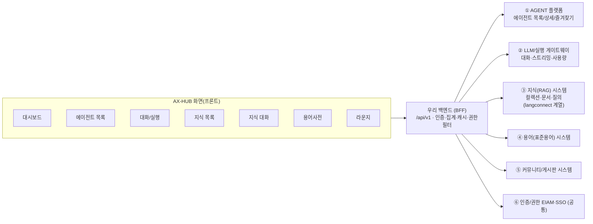

# 화면별 필요 API 도출서 (외부 업무 시스템 연동 요청용)

> **목적**: AX-HUB 각 화면을 구성하기 위해 **외부 업무 시스템에 요청할 API**를 화면 기준으로 도출한다.
> **연동 구조**: `화면(프론트)` → `우리 백엔드(BFF · /api/v1)` → `외부 업무 시스템 API`
> **사용법**: 이 목록을 각 소스 시스템 담당에 전달해, 각 API의 **정의서(요청/응답 스키마·인증·페이지네이션·에러·SLA)**를 요청한다.
>
> ⚠ 본 문서의 **경로(path)는 제안**이며, **소스 시스템 매핑은 현재 화면·코드 기준의 추정**이다. 실제 규격은 각 시스템에서 받는 정의서로 확정한다. (근거: `src/pages/*`, `src/data.js`, `src/features/*/services`, AgentFab의 외부 빌더 링크 `deepagent-builder.ai` · `langconnect`)

---

## 0. 연동 개요 · 소스 시스템 매핑

**소스 시스템(추정) 및 접두어**

| 코드 | 소스 시스템(추정) | 담당 업무 | 화면 |
|---|---|---|---|
| **AGENT** | 에이전트 플랫폼 (deepagent-builder 계열) | 에이전트 목록·상세·즐겨찾기·활성·폴더 | 대시보드, 에이전트 목록, 대화(정보) |
| **LLM** | 에이전트 실행·대화 게이트웨이 | 대화 세션·메시지 스트리밍·사용량(토큰) | 대화, 지식 대화, 용어사전(대화형) |
| **RAG** | 지식(RAG) 시스템 (langconnect 계열) | 컬렉션·지식·문서·RAG 질의 | 지식 목록, 지식 대화 |
| **TERM** | 용어/표준용어 시스템 | 용어 검색·상세·분류 | 용어사전 |
| **COMM** | 커뮤니티/게시판 시스템 | 게시판·게시글·조회수 | 대시보드(최신글), 라운지 |
| **IAM** | 인증/권한 (EIAM·SSO) | 로그인·사용자·역할·권한 | 전 화면(공통) |
| **PERM** | 권한 요청/승인 (내부 또는 연계) | 에이전트·지식·도구 권한 상태/신청 | 목록·상세·마이페이지 |

**공통 규약(각 시스템 정의서에 반드시 포함 요청)** — 상세는 §10 체크리스트.
인증(Bearer/서비스토큰) · 표준 응답 envelope · 에러 포맷 · **페이지네이션(page/size 또는 cursor)** · 정렬·필터 파라미터 · 목록/상세 분리 · 부분필드(fields) · Rate limit · SLA(응답시간).

---

## 1. 대시보드 (홈) `home`

**화면 구성** → My Agent 폴더 트리 · Work Space(추천/인기 에이전트) · 액션 타일(즐겨찾기) · 현황 스탯 4종 · 커뮤니티 컬럼 4종. → **집계(aggregation) 화면**으로, 대부분 타 시스템 목록/요약 API를 재사용하고 BFF에서 합성.

| API ID | 화면 요소 / 기능 | 메서드 · 경로(제안) | 요청 | 응답 주요 필드 | 소스 |
|---|---|---|---|---|---|
| DASH-01 | 대시보드 요약(스탯 4종: 나의 에이전트/승인된 에이전트/권한요청 지식/권한요청 도구) | `GET /dashboard/summary` | userId(토큰) | myAgentCount, approvedAgentCount, pendingKnowledgeCount, pendingToolCount | BFF 합성(AGENT+PERM) |
| DASH-02 | My Agent 폴더 트리(폴더별 내 에이전트) | `GET /agents?owner=me&group=folder` | 토큰 | folders[{name,count,items[{id,name,desc}]}] | AGENT |
| DASH-03 | Work Space(추천·인기 에이전트) | `GET /agents/recommended?limit=6` | 토큰 | items[{id,name,desc,tags[]}] | AGENT |
| DASH-04 | 즐겨찾기 에이전트(액션 타일) | `GET /agents?fav=true` | 토큰 | items[{id,name,fav}] | AGENT |
| DASH-05 | 커뮤니티 컬럼(공지/커뮤니티/문의/가이드 최신 3건씩) | `GET /community/boards/{boardId}/posts?size=3` | boardId | items[{title,date}] | COMM |

> 재사용 원칙: DASH-02·03·04는 §2 AGENT 목록 API에 파라미터만 다르게 준다. DASH-05는 §7 COMM 목록 API 재사용. **DASH-01(요약)만 신규 집계 엔드포인트 요청**.

---

## 2. 에이전트 목록 `agents` (+ 상세 모달)

**화면 구성** → 탭(내/전체/즐겨찾기) · 검색 · 상태 필터(실행가능/권한필요) · 태그(도구) · 폴더 그룹 · 카드(이름·설명·도구태그·소유·공유수·상태) · 상세 모달(모델·버전·도구·예시질문·연결지식·실행수).

| API ID | 화면 요소 / 기능 | 메서드 · 경로(제안) | 요청 | 응답 주요 필드 | 소스 |
|---|---|---|---|---|---|
| AGENT-01 | 에이전트 목록(탭·검색·상태·태그·정렬·페이지) | `GET /agents` | tab(mine/all/fav), q, scope, status, tag, folder, sort, page, size | items[{id,name,desc,owner,scope,perm,active,fav,category,model,version,updated,runs,knowledge,tools[],shares}], page 정보 | AGENT |
| AGENT-02 | 에이전트 상세(정보 모달) | `GET /agents/{id}` | id | 위 필드 + examples[], skills[], linkedKnowledge[] | AGENT |
| AGENT-03 | 폴더 목록 / 폴더별 개수 | `GET /agents/folders` | 토큰 | folders[{name,count}] | AGENT |
| AGENT-04 | 태그(도구) 목록(해시태그 필터) | `GET /agents/tags` | scope | tags[] | AGENT |
| AGENT-05 | 즐겨찾기 토글 | `PUT /agents/{id}/favorite` | {fav} | ok | AGENT |
| AGENT-06 | 내 소유 에이전트 활성/비활성 | `PUT /agents/{id}/active` | {active} | ok | AGENT |
| AGENT-07 | 폴더 이동 | `PUT /agents/{id}/folder` | {folder} | ok | AGENT |
| AGENT-08 | 실행 가능 여부 판정용 도구 권한 상태 | `GET /agents/{id}/readiness` | id | ready(bool), missingTools[] | AGENT+PERM |

> 핵심 규칙: 카드 버튼(실행/요청중/권한요청)은 **에이전트가 쓰는 도구 권한 보유 여부(agentReady)**로 분기 → AGENT-08(또는 목록 응답에 readiness 포함) 필요.

---

## 3. 에이전트 대화 · 실행 `run`

**화면 구성** → 좌: 대화 목록(생성/이름변경/삭제·검색) · 중: 대화창(메시지·타이핑·추천질문·입력·토큰/비용) · 우: 인사이트(에이전트 정보·사용통계·연결지식·관련 가이드).

| API ID | 화면 요소 / 기능 | 메서드 · 경로(제안) | 요청 | 응답 주요 필드 | 소스 |
|---|---|---|---|---|---|
| LLM-01 | 에이전트별 대화(세션) 목록 | `GET /agents/{id}/conversations` | id, page | items[{id,title,when,lastMessageAt}] | LLM |
| LLM-02 | 새 대화 생성 | `POST /agents/{id}/conversations` | {title?} | {id,title,when} | LLM |
| LLM-03 | 대화 메시지 조회 | `GET /conversations/{cid}/messages` | cid | items[{role,text,createdAt,usage}] | LLM |
| LLM-04 | **메시지 전송(스트리밍 응답)** | `POST /conversations/{cid}/messages` (SSE/WebSocket) | {text} | stream: token delta, done, usage{inTokens,outTokens,cost} | LLM |
| LLM-05 | 대화 이름 변경 | `PUT /conversations/{cid}` | {title} | ok | LLM |
| LLM-06 | 대화 삭제 | `DELETE /conversations/{cid}` | cid | ok | LLM |
| LLM-07 | 추천 질문(에이전트 예시) | `GET /agents/{id}/suggestions` | id | items[] (또는 AGENT-02 examples 재사용) | AGENT |
| LLM-08 | 사용 인사이트(누적 실행·통계) | `GET /agents/{id}/insights` | id | runs, sessions, tokenUsage | LLM/AGENT |
| LLM-09 | 연결 지식(RAG) 목록(인사이트) | `GET /agents/{id}/knowledge` | id | items[{id,name,docs}] | RAG |
| LLM-10 | 신고/개선요청 접수 | `POST /agents/{id}/reports` | {category,items[],reason,scriptSnapshot} | {reportId,status} | PERM/COMM |

> 스트리밍(LLM-04)이 이 화면의 핵심. 정의서에 **전송 프로토콜(SSE/WebSocket), 델타 포맷, 종료 이벤트, 사용량(usage) 필드, 타임아웃/중단** 규격을 반드시 요청.

---

## 4. 지식 목록 `knowledge` (+ 문서 목록)

**화면 구성** → 좌: 컬렉션 트리(카테고리 계층·하위 카운트 합산) · 우: 지식 카드/리스트(이름·공개범위·소유부서·문서수·연결에이전트·최신화·권한) · 상세: 문서 목록(지식명·등록일자·버전·등록자·등록부서).

| API ID | 화면 요소 / 기능 | 메서드 · 경로(제안) | 요청 | 응답 주요 필드 | 소스 |
|---|---|---|---|---|---|
| RAG-01 | 컬렉션(카테고리) 트리 | `GET /knowledge/collections` | 토큰 | tree[{id,name,children[],count}] | RAG |
| RAG-02 | 지식 목록(컬렉션·검색·범위·페이지) | `GET /knowledge` | collectionId, q, scope, page, size | items[{id,name,desc,owner,scope,perm,docs,linked,updated,category}] | RAG |
| RAG-03 | 지식 상세 | `GET /knowledge/{id}` | id | 위 필드 + 통계 | RAG |
| RAG-04 | 지식 문서 목록(상세 팝업) | `GET /knowledge/{id}/documents` | id, page | items[{docName,registeredAt,version,registrant,dept}] | RAG |

> 문서 목록 컬럼(지식명·등록일자·버전·등록자·등록부서)이 그대로 RAG-04 응답 필드가 된다.

---

## 5. 지식 대화 (RAG) `knowledge (chat)`

**화면 구성** → 보유 지식 중 대상 선택(다중) → 선택 지식을 근거로 질의 → 근거 문장/출처와 함께 답변.

| API ID | 화면 요소 / 기능 | 메서드 · 경로(제안) | 요청 | 응답 주요 필드 | 소스 |
|---|---|---|---|---|---|
| RAG-05 | 지식 대화(RAG 질의) — 선택 지식 근거 | `POST /knowledge/query` (SSE 가능) | {knowledgeIds[], question, topK?} | answer, citations[{knowledgeId,docName,snippet,score}], usage | RAG(+LLM) |
| RAG-06 | 내 대화 가능한 지식(보유/소유) 목록 | `GET /knowledge?perm=granted,owner` | 토큰 | items[{id,name,docs}] (RAG-02 재사용) | RAG |

> 정의서에 **근거(citation) 반환 여부/포맷, topK, 스트리밍 여부, 다중 컬렉션 질의 지원**을 명시 요청.

---

## 6. 용어사전 `glossary`

**화면 구성** → 대화형 용어 조회(질의→뜻·분류·관련용어) · 조회 이력(세션) · 용어 분류 카운트 · 자주 찾는 용어.

| API ID | 화면 요소 / 기능 | 메서드 · 경로(제안) | 요청 | 응답 주요 필드 | 소스 |
|---|---|---|---|---|---|
| TERM-01 | 용어 검색(부분일치·동의어) | `GET /terms/search` | q, size | items[{term,category,definition,related[]}] | TERM |
| TERM-02 | 용어 상세 | `GET /terms/{id}` | id | term, category, definition, related[], aliases[] | TERM |
| TERM-03 | 용어 분류 목록(+건수) | `GET /terms/categories` | — | items[{name,count}] | TERM |
| TERM-04 | 자주 찾는/인기 용어 | `GET /terms/popular?limit=6` | — | items[{term}] | TERM |
| TERM-05 | 조회 이력 저장/조회(선택) | `GET/POST /terms/history` | 토큰 | items[{query,term,at}] | BFF/TERM |

> 현재 화면은 로컬 매칭(목데이터)으로 동작. TERM-01(검색)만 있어도 화면 구성 가능하며, 자연어 질의를 원하면 LLM-04 유형의 대화 엔드포인트로 확장.

---

## 7. 라운지 (커뮤니티) `community`

**화면 구성** → 게시판 목록(사이드바) · 게시판별 게시글 목록(제목·작성자·날짜·조회수·연결에이전트) · 공지 스트립 · 글 작성 · 관련 에이전트 실행.

| API ID | 화면 요소 / 기능 | 메서드 · 경로(제안) | 요청 | 응답 주요 필드 | 소스 |
|---|---|---|---|---|---|
| COMM-01 | 게시판 목록 | `GET /community/boards` | 토큰 | items[{id,name,desc,badge/count}] | COMM |
| COMM-02 | 게시판별 게시글 목록(페이지) | `GET /community/boards/{boardId}/posts` | boardId, q, page, size | items[{id,title,author,date,views,agentId?}], page | COMM |
| COMM-03 | 게시글 상세(조회수 증가) | `GET /community/posts/{postId}` | postId | id,title,body,author,date,views,attachments[],agentId? | COMM |
| COMM-04 | 게시글 작성 | `POST /community/boards/{boardId}/posts` | {title,body,attachments[]} | {postId} | COMM |
| COMM-05 | 공지 배너/중요 공지 | `GET /community/notices?active=true` | — | items[{title,link}] | COMM |

> 게시글의 `agentId`(관련 에이전트)는 COMM ↔ AGENT 연계 키. 정의서에 **연결 에이전트 식별자 포함 여부**를 요청.

---

## 8. 공통 · 횡단 API (전 화면)

| API ID | 기능 | 메서드 · 경로(제안) | 응답 주요 필드 | 소스 |
|---|---|---|---|---|
| IAM-01 | 로그인(SSO 콜백/토큰 교환) | `POST /auth/login` | accessToken, refreshToken | IAM |
| IAM-02 | 내 정보(사용자·부서·역할) | `GET /auth/me` | userId, name, dept, roles[] | IAM |
| PERM-01 | 내 권한 상태(에이전트/지식/도구) | `GET /permissions/me` | grants[{targetType,targetId,perm}] | PERM |
| PERM-02 | 권한 신청 | `POST /permissions/requests` | {targetType,targetId,reason,period,approvers[]} | PERM |
| PERM-03 | 권한 요청/승인 목록 | `GET /permissions/requests?scope=mine\|approve` | items[...] | PERM |

> 권한 상태(PERM-01)는 목록/상세 응답의 `perm` 필드로 화면에 매핑되며, **에이전트·지식·도구 카드의 버튼 분기의 근거**가 된다.

---

## 9. 통합 API 목록 (소스 시스템별 마스터)

| 소스 | API |
|---|---|
| **AGENT** | AGENT-01~08, DASH-02~04, LLM-07 |
| **LLM** | LLM-01~06, LLM-08 |
| **RAG** | RAG-01~06, LLM-09 |
| **TERM** | TERM-01~05 |
| **COMM** | COMM-01~05, DASH-05, LLM-10(연계) |
| **IAM/PERM** | IAM-01~02, PERM-01~03, DASH-01(집계), AGENT-08(연계) |

**신규 집계(BFF 자체 구현, 외부 요청 불필요 가능)**: DASH-01(요약).
**최우선 요청(화면 동작 필수)**: AGENT-01/02, LLM-01~04(스트리밍), RAG-01/02/04/05, COMM-01/02, IAM-02, PERM-01.

---

## 10. 소스 시스템에 요청할 "API 정의서" 항목 (체크리스트/템플릿)

각 소스 시스템에 아래 항목이 포함된 정의서를 요청한다.

1. **엔드포인트**: 메서드 · 전체 URL · 버전 · 환경별(dev/stg/prod) base URL
2. **인증**: 방식(OAuth2 client-credentials / 서비스 토큰 / mTLS), 토큰 발급/갱신, 스코프
3. **요청 스키마**: path/query/body 파라미터(필수·타입·기본값·제약), 예시
4. **응답 스키마**: 필드 타입·null 여부·enum 값, 성공/에러 예시(JSON)
5. **페이지네이션**: 방식(page/size vs cursor), 최대 size, 정렬 파라미터
6. **필터·검색**: 지원 필터 키, 부분일치/동의어 규칙(용어·검색)
7. **스트리밍(대화)**: 프로토콜(SSE/WebSocket), 델타·종료 이벤트, 사용량(usage), 타임아웃·중단
8. **에러 포맷**: 코드 체계, HTTP status 매핑, 재시도 가능 여부
9. **성능/운영**: Rate limit, SLA(p95 응답), 캐시 가능 여부/TTL, 대량조회 제한
10. **권한·데이터 범위**: 사용자·부서 기준 데이터 필터(멀티테넌시), 필드 마스킹
11. **식별자·연계 키**: 에이전트↔지식↔게시글 연결 키(예: agentId, knowledgeId)
12. **웹훅/이벤트(선택)**: 상태 변경 알림(권한 승인·지식 최신화 등)

### 요청 항목 요약표(소스 시스템 전달용)

| 소스 시스템 | 필요 API 수 | 핵심 요청 포인트 |
|---|---|---|
| AGENT | 8+ | 목록 필터/페이지·상세·즐겨찾기/활성·폴더·**readiness(도구권한)** |
| LLM | 8 | 대화 세션 CRUD·**메시지 스트리밍(usage 포함)**·인사이트 |
| RAG | 6 | 컬렉션 트리·지식 목록/문서·**RAG 질의(citation)** |
| TERM | 5 | 용어 검색(동의어)·상세·분류·인기 |
| COMM | 5 | 게시판·게시글 목록/상세/작성·공지·**연결 에이전트 키** |
| IAM/PERM | 5 | 로그인·내정보(부서/역할)·권한 상태/신청 |

---

*본 도출서는 현재 AX-HUB 화면(`src/pages/*`)과 데이터 형태(`src/data.js`)를 근거로 작성되었다. 경로는 제안, 소스 시스템은 추정이며, 확정 규격은 각 시스템 정의서로 대체한다. 화면이 바뀌면 이 문서도 함께 갱신한다.*
